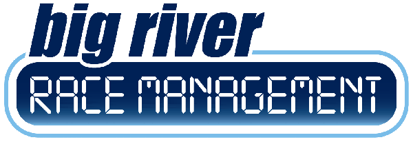

# Race Display System 🏃‍♂️

A professional real-time race display system with ChronoTrack Live integration for live race events. Built with Flask and React.



## ✨ Features

- **Real-time Timing Integration** - Direct connection to ChronoTrack Live timing systems
- **Dynamic Runner Display** - Show participant information as they cross timing points
- **Custom Templates** - Visual template builder with drag-and-drop interface
- **Message Management** - Personalized messages for race participants
- **Multi-Provider Support** - ChronoTrack Live and RunSignUp integration
- **Queue Management** - Intelligent runner queuing for high-volume events
- **Image Upload** - Support for logos, backgrounds, and branding
- **Responsive Design** - Works on displays of all sizes

## 🚀 Live Production Usage

This system has been successfully deployed for live race events with:
- ✅ **11,085+ participants** loaded and processed
- ✅ **Real-time timing data** from ChronoTrack Live
- ✅ **Custom messaging system** for participant engagement
- ✅ **High-volume data processing** with queue management
- ✅ **Professional race displays** for events like the Bix 7

## 🛠️ Technology Stack

**Backend:**
- Python 3.8+ with Flask
- Real-time TCP socket communication
- ChronoTrack Live API integration
- RunSignUp API integration

**Frontend:**
- React 18 with modern hooks
- GrapesJS visual editor
- Bootstrap 5 styling
- Real-time WebSocket updates

## 📦 Quick Start

### 1. Clone and Setup
```bash
git clone https://github.com/yourusername/race-display-system.git
cd race-display-system

# Create virtual environment
python3 -m venv venv
source venv/bin/activate  # Windows: venv\Scripts\activate

# Install Python dependencies
pip install -r requirements.txt
```

### 2. Frontend Setup
```bash
cd frontend
npm install
npm run build
cd ..
```

### 3. Configuration
Copy and edit the configuration file:
```bash
cp config.py config.py.local
# Edit config.py with your ChronoTrack credentials
```

### 4. Run the Application
```bash
source venv/bin/activate
python app.py
```

Visit **http://127.0.0.1:8000** to access the system.

## 🔧 ChronoTrack Live Configuration

Configure your ChronoTrack Live system to send timing data:

- **Host**: `127.0.0.1` (or your server IP)
- **Port**: `61611`
- **Protocol**: `CT01_33`
- **Format**: Standard ChronoTrack timing format

## 🎯 Usage Workflow

1. **Choose Mode**
   - **Results**: Login with your ChronoTrack or RunSignUp credentials
   - **Pre-race**: Load participant roster **without needing ChronoTrack credentials**
2. **Select Event** from your available races
3. **Customize Display**:
   - Add custom messages for participants
   - Upload logos and background images
   - Create templates using the visual editor
4. **Go Live**: Real-time participant display as timing data arrives

## 📁 Project Structure

```
race-display-system/
├── app.py                 # Main Flask application
├── config.py             # Configuration settings
├── requirements.txt      # Python dependencies
├── frontend/            # React application
│   ├── src/            # React source code
│   ├── dist/           # Built frontend assets
│   └── package.json    # Node.js dependencies
├── static/
│   ├── images/         # Static images
│   └── uploads/        # User uploaded content
├── data/
│   └── messages.json   # Custom messages
├── saved_templates/    # Display templates
└── templates/          # Flask templates
```

## 🔍 API Endpoints

- `GET /api/current-runner` - Get current runner in display queue
- `POST /api/login` - Authenticate with timing provider
- `GET /api/providers` - List available timing providers
- `POST /api/select-mode` - Choose pre-race or results mode
- `GET /api/messages` - Manage custom messages
- `POST /api/upload-image` - Upload images for display

## 🏁 Race Event Setup

### For Live Events:
1. Start the application on your display computer
2. Login with your race event credentials
3. Load the participant roster (supports 10,000+ participants)
4. Configure ChronoTrack Live to send data to your system
5. Test the connection with sample timing data
6. Go live for your race event

### Message Customization:
- Add personalized messages via the web interface
- Messages are randomly assigned to participants
- Support for race-specific messaging (e.g., "Crush Brady Street!")

## 🔒 Security Notes

- Store actual credentials in `config.py` (not tracked in git)
- Use environment variables for production deployments
- Secure your timing data TCP port (61611) appropriately
- Run behind a reverse proxy for production use

## 📋 System Requirements

- **Python 3.8+**
- **Node.js 16+** (for frontend development)
- **ChronoTrack Live** or compatible timing system
- **Modern web browser** for display interface

## 🤝 Contributing

1. Fork the repository
2. Create a feature branch
3. Make your changes
4. Test with real timing data
5. Submit a pull request

## 📄 License

This project is licensed under the MIT License - see the LICENSE file for details.

## 🏆 Production Ready

This system is **production-tested** and ready for live race events. It has successfully handled major race events with thousands of participants and real-time timing data processing.

---

**Built for race directors, by race technology specialists** 🏃‍♂️🏃‍♀️ 